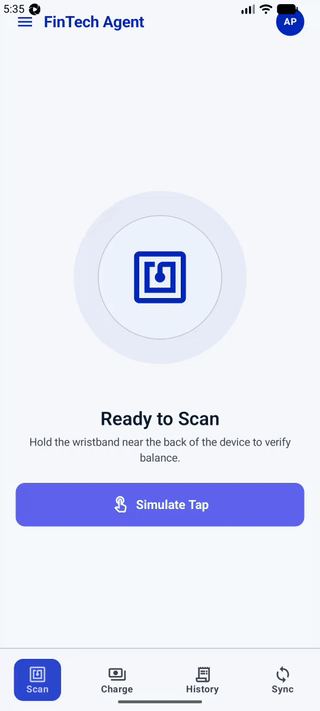
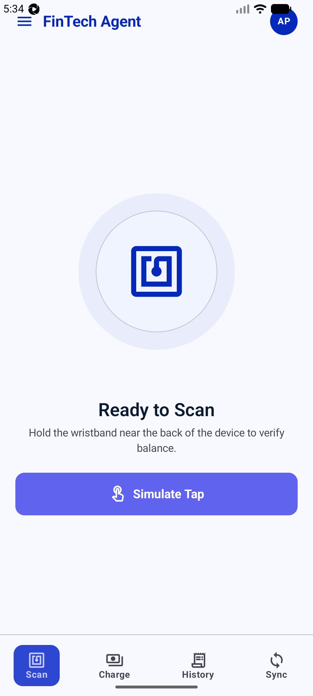
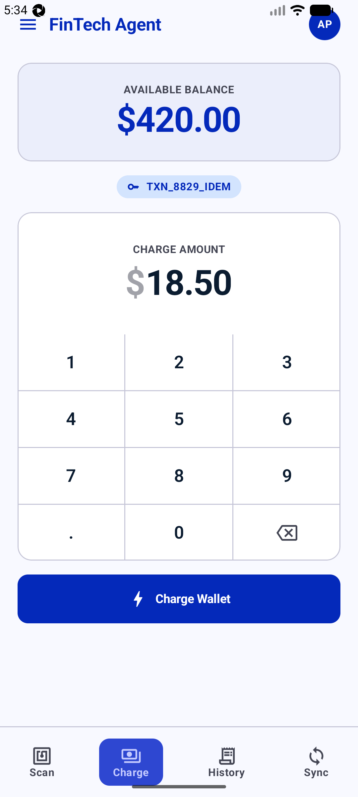
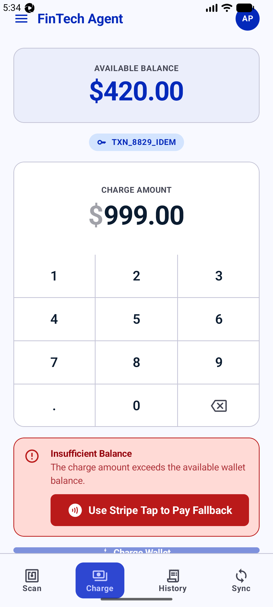
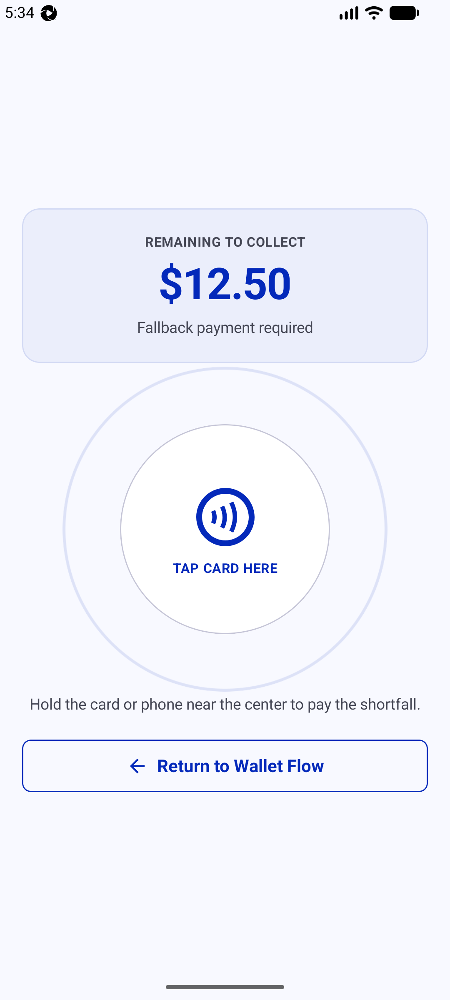
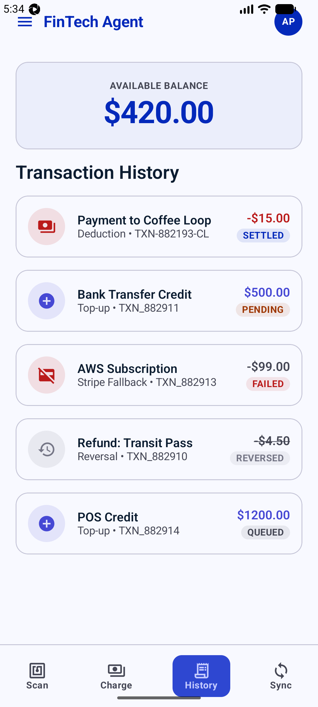
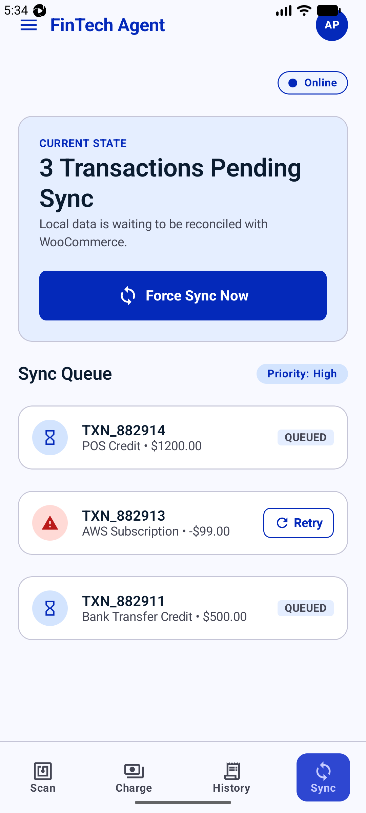
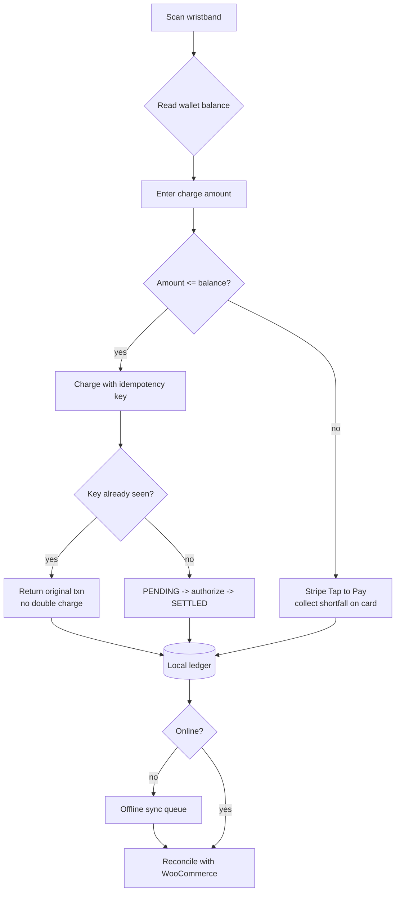

# Secure Flux - NFC Wristband Wallet + Stripe Tap to Pay (Native Android)

A native **Android / Kotlin / Jetpack Compose** POC of an RFID/NFC wristband
wallet terminal for live events. Agents scan a wristband to read its wallet
balance, charge a sale against it, and - when the balance is short - fall back
to **Stripe Tap to Pay** on the same phone. Built for the money-handling
priorities that matter here: **idempotency, a strict transaction state machine,
and an offline queue that reconciles with WooCommerce**.



## What it shows

- **NFC scan -> balance**: tap a wristband (simulated behind a button so it runs
  on any emulator) to verify its wallet balance.
- **Idempotent charge**: every charge carries an idempotency key. A double-tap
  or a network retry with the same key returns the original result instead of
  charging twice.
- **Stripe Tap to Pay fallback**: when the wallet is short, the agent collects
  only the shortfall on a card via the phone's contactless reader.
- **Transaction state machine**: `QUEUED -> PENDING -> SETTLED`, with
  `FAILED -> retry` and `SETTLED -> REVERSED` (duplicate-tap / refund). Each
  state has its own color-coded chip.
- **Offline-first sync**: charges written while offline sit in a local queue and
  reconcile against the WooCommerce ledger when the connection returns, with a
  live progress bar and per-row retry.

## Screens

| Scan wristband | Charge sale | Insufficient -> fallback |
| --- | --- | --- |
|  |  |  |

| Stripe Tap to Pay | Transaction history | Offline sync queue |
| --- | --- | --- |
|  |  |  |

## Flow



## Architecture

- **UI**: Jetpack Compose, Navigation-Compose, a hand-built design system that
  maps the **Secure Flux** Stitch tokens (see `design/`) - indigo/white,
  Inter type scale, 8px spacing rhythm.
- **State**: `WalletViewModel` (AndroidViewModel) exposes `StateFlow`s per
  screen; charge/fallback/sync are suspend calls.
- **Data**: `WalletRepository` is the single source of truth. Room persists the
  transaction ledger; the idempotency key is a unique guard at the DAO layer.
  WooCommerce Wallet REST calls are mocked with realistic latency so the whole
  flow is demoable on a simulator with no backend.

```
ui/screens  ->  vm/WalletViewModel  ->  data/WalletRepository  ->  Room (ledger)
                                                              \->  WooCommerce (mocked)
```

## Run

```bash
# boot an emulator first, then:
./gradlew :app:installDebug
adb shell am start -n com.secureflux.wallet/.MainActivity
```

Requires Android Studio / SDK 34, JDK 17. `minSdk 26`.
